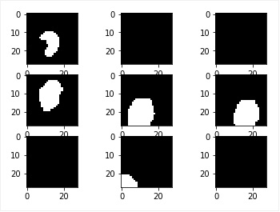
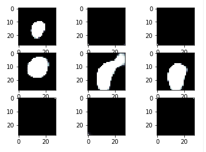

# Segmenting Soft-Tissue Sarcoma Using Convolutional Neural Networks

![alt text][(images/better_banner.png)](https://www.kaggle.com/4quant/soft-tissue-sarcoma)

The architectures are inspired by:
* [U-Net: Convolutional Networks for Biomedical Image Segmentation](http://lmb.informatik.uni-freiburg.de/people/ronneber/u-net/).
* [Fully Convolutional Networks for Semantic Segmentation](https://people.eecs.berkeley.edu/~jonlong/long_shelhamer_fcn.pdf).
* [Brain Tumor Segmentation with Deep Neural Networks](https://arxiv.org/pdf/1505.03540.pdf).
* [MULTI-SCALE CONTEXT AGGREGATION BY DILATED CONVOLUTIONS](https://arxiv.org/pdf/1511.07122.pdf)

---

## Overview

### Data

* The train and test data can be downloaded from this kaggle challenge: [Segmenting Soft-Tissue Sarcoma](https://www.kaggle.com/4quant/soft-tissue-sarcoma) .
* The data is a preprocessed subset of the TCIA Study named [Soft Tissue Sarcoma](https://wiki.cancerimagingarchive.net/display/Public/Soft-tissue-Sarcoma). The data have been converted from DICOM folders of varying resolution and data types to 3D HDF5 arrays with isotropic voxel size. 
* __TCIA Summary:__
This collection contains FDG-PET/CT and anatomical MR (T1-weighted, T2-weighted with fat-suppression) imaging data from 51 patients with histologically proven soft-tissue sarcomas (STSs) of the extremities. All patients had pre-treatment FDG-PET/CT and MRI scans between November 2004 and November 2011. (Note: date in the TCIA images have been changed in the interest of de-identification; the same change was applied across all images, preserving the time intervals between serial scans). During the follow-up period, 19 patients developed lung metastases. Imaging data and lung metastases development status were used in the following study:
* *Vallières, M. et al. (2015). A radiomics model from joint FDG-PET and MRI texture features for the prediction of lung metastases in soft-tissue sarcomas of the extremities. Physics in Medicine and Biology, 60(14), 5471-5496. doi:10.1088/0031-9155/60/14/5471.*
* See the dataset and TCIA study for more information.

### Preprocessing

The images are 3-D numpy arrays in h5py groups.
To do data augumentation, refer to the __data_gen.py__ and helper functions in __utils.data-func.py__ and __utils.preprocess.py__.

### Models

This deep neural network is implemented with Keras functional API, which makes it extremely easy to experiment with different interesting architectures.

Output from the network is a (28.28) array, which represents mask that should be learned. Sigmoid activation function
makes sure that mask pixels are in \[0, 1\] range.

### Training
Training can be run using __train.py__.
Loss function for the training is dice loss based on the soft dice coefficient.

---

## How to use

### Dependencies

This tutorial depends on the following libraries:

* Tensorflow
* Keras >= 1.0
* Python 3.5

### Prepare the data
* Run ```python data_gen.py``` to generate the normalized and resized data. The module automatically makes a data directory, 'data' if it does not already exist. 
* The data is in .npy format and uses functions from __preprocess.py__.

### Train the models and generate masks for test images

* Run ```python train.py``` to train the model. Make sure to alter the train.py to import the model that you want from __model.py__.
* To get masks and evaluated dice coefficients, run ```python evaluation.py```.

## Results
Models achieve from 0.5-0.75 dice. The example in __evaluation example.ipynb__ demonstrates the results from the 2D Unet implementation.

 

## Paper
* [Automated Segmentation of Soft-Tissue Sarcoma Using Convolutional Neural Networks](https://docs.google.com/document/d/e/2PACX-1vQ--PDV8DPc5A8jEY6ev5b8s_vfg9-zpi6UJNkQ22k1SLZLncRktxP1MGT7T6OmBszc1NZ9CgKDUC-a/pub)
* written by me; still need to convert the writing to latex

## About Keras

Keras is a minimalist, highly modular neural networks library, written in Python and capable of running on top of either TensorFlow or Theano. It was developed with a focus on enabling fast experimentation. Being able to go from idea to result with the least possible delay is key to doing good research.

Use Keras if you need a deep learning library that:

* allows for easy and fast prototyping (through total modularity, minimalism, and extensibility).
* supports both convolutional networks and recurrent networks, as well as combinations of the two.
* supports arbitrary connectivity schemes (including multi-input and multi-output training).
* runs seamlessly on CPU and GPU.

_Read the documentation: [Keras.io](http://keras.io/)_

Keras is compatible with: Python 2.7-3.5.
